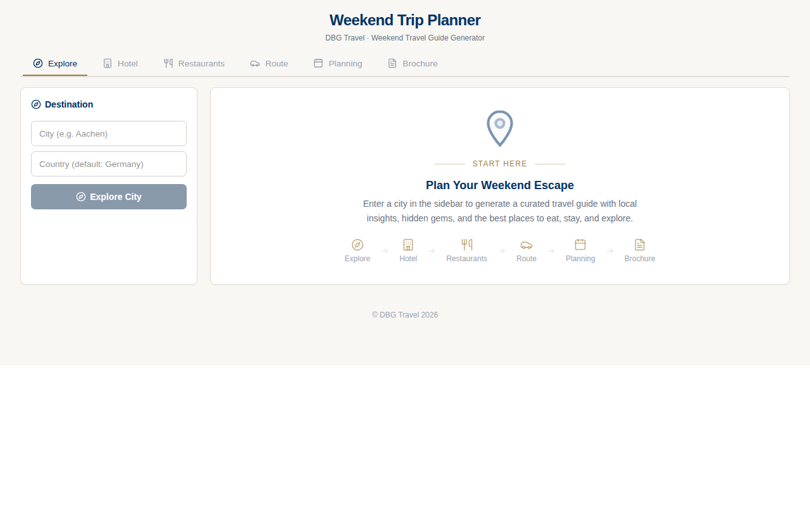
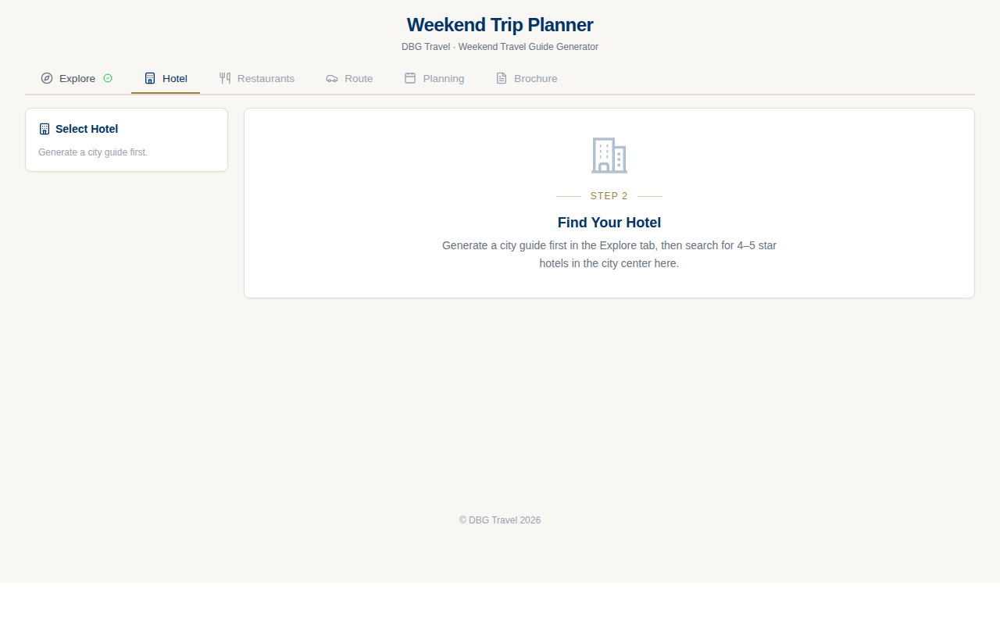

# DBG Travel — Trip Planner

A weekend trip planner web application that generates branded PDF travel brochures. Enter your destination, and it produces a complete weekend guide with route planning, hotel recommendations, restaurant selection, sightseeing, and EV charging details — all formatted in the DBG Travel brand style.

## Architecture

```
├── backend/          FastAPI (Python) — 13 API endpoints
│   ├── main.py       App entry point
│   ├── config.py     Constants, addresses, thresholds, model selection
│   ├── services/     9 service modules
│   │   ├── llm.py             LLM prompt orchestration (auto-fallback on overload)
│   │   ├── city_guide.py      City descriptions
│   │   ├── hotels.py          Hotel search, photos, indoor parking lookup, Folium maps
│   │   ├── restaurants.py     Restaurant search & filtering
│   │   ├── tourist_office.py  Tourist info + Folium map
│   │   ├── geo.py             Geocoding & maps
│   │   ├── charging.py        EV charging station lookup
│   │   ├── planner.py         Weekend itinerary generation
│   │   └── pdf.py             PDF generation (LaTeX → PDF)
│   └── templates/
│       └── travel_template.tex   LaTeX template
├── frontend/         React 19 + TypeScript 6 + Vite 8 + Tailwind 4
│   └── src/
│       ├── App.tsx    6-step wizard (Explore → Hotel → Restaurants → Route → Planning → Brochure)
│       └── index.css  DBG Travel brand theme (navy/gold)
├── docs/              Screenshots and documentation images
├── SESSION_CONTEXT.md  Session state tracking
├── REQUIREMENTS.md     Feature specification & issue tracking
└── myTripPlanner_V08.ipynb  Original Gradio notebook (frozen reference)
```

## Setup

### Prerequisites

- Python 3.11+
- Node.js 18+
- LaTeX installation (for PDF generation: `texlive-xetex`, `texlive-latex-extra`, `pandoc`)

### Backend

**Linux/macOS:**
```bash
# From the project root
python3 -m venv .venv
source .venv/bin/activate
uv pip install -r backend/requirements.txt
```

**Windows (PowerShell):**
```powershell
# From the project root
python -m venv .venv
.venv\Scripts\Activate.ps1
uv pip install -r backend/requirements.txt
```

If `uv` is not available, use `pip` instead of `uv pip` — it's slower but works.

Create a `.env` file in the project root with your API keys:

```env
OPENROUTER_API_KEY=...          # LLM provider (default model: openai/gpt-4o-mini)
TAVILY_API_KEY=...              # Web search + cover image search
ORS_API_KEY=...                 # OpenRouteService — routing & directions
GOOGLE_MAPS_API_KEY=...         # Places, hotel & restaurant details
```

Then start the server:

```bash
uvicorn backend.main:app --reload --port 8000
```

### Frontend

```bash
cd frontend
npm install
npm run dev
```

Open http://localhost:5173 in your browser.

### PDF Generation

PDFs are produced server-side via LaTeX (pandoc + xelatex). Ensure you have the required TeX packages:

```bash
sudo apt install texlive-xetex texlive-latex-extra pandoc
```

Additional: `fonts-font-awesome` for icons in PDFs. The PDF template also requires Ghostscript for compression (`gs`).

## Usage

1. Open the frontend (or call the API directly)
2. Enter your destination city
3. Select travel dates (Friday → Sunday)
4. Choose hotel preferences and restaurant cuisines
5. Generate your weekend itinerary
6. Download the PDF brochure

## Key Preferences

- Departure from: **Heirweg 85A, 9190 Stekene, Belgium**
- Hotels: 4–5 star only
- Cuisines: local, Italian, Croatian, grill, steakhouse, seafood
- Walking cap: 1.5 km (take taxi beyond that)
- Weekend: Friday 5–6 PM arrival → Sunday 5–7 PM return home
- Budget: ~€1500–2000 for 3 people (hotel, dinner, drinks)

## Tech Stack

- **Backend:** FastAPI, OpenRouter (GPT-4o), Google Maps API, OpenRouteService, Tavily Search
- **Frontend:** React 19, TypeScript 6, Vite 8, Tailwind 4, DaisyUI, react-markdown
- **PDF:** LaTeX via pandoc + xelatex

## Screenshots

| Explore tab | Hotel tab |
|:---:|:---:|
|  |  |