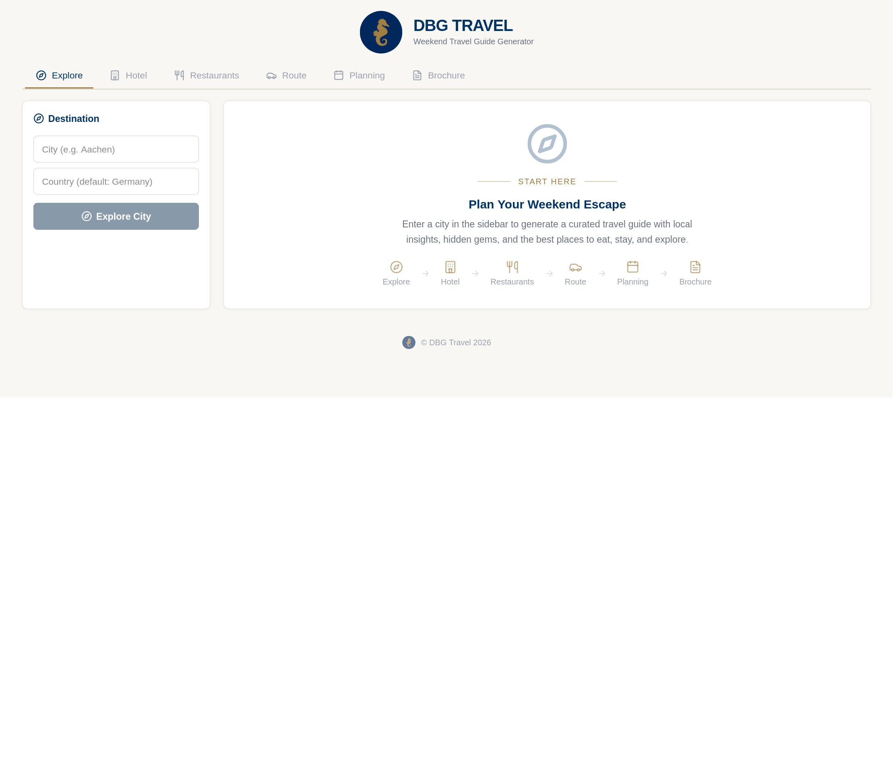
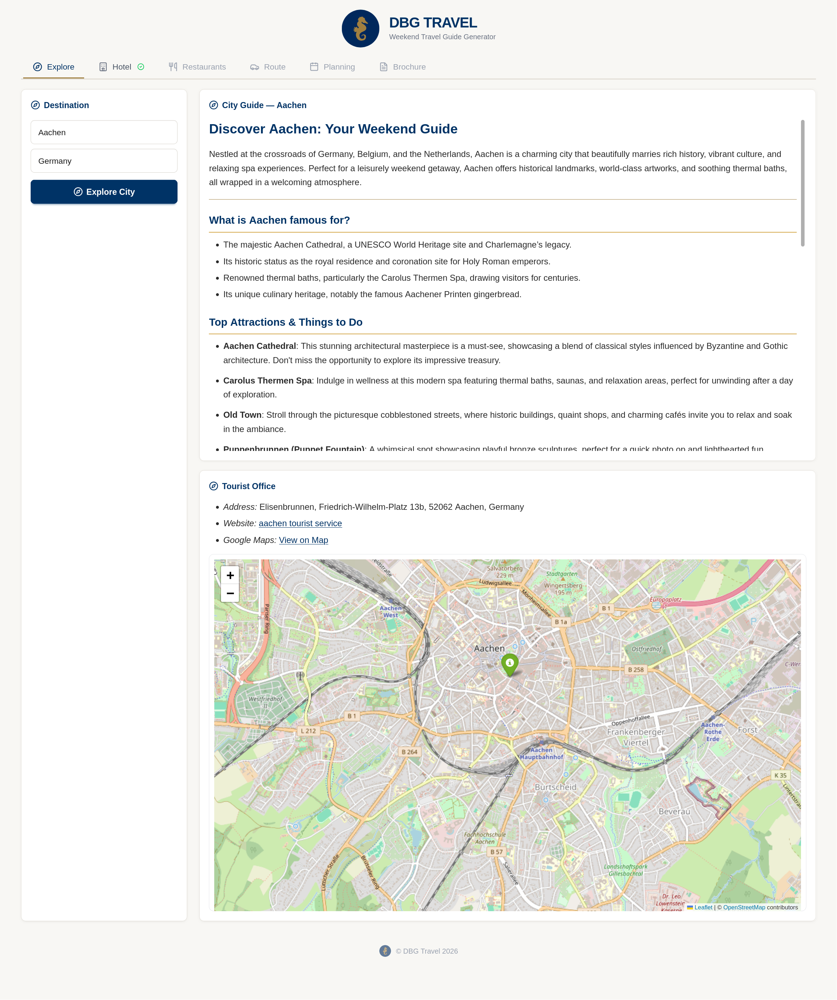
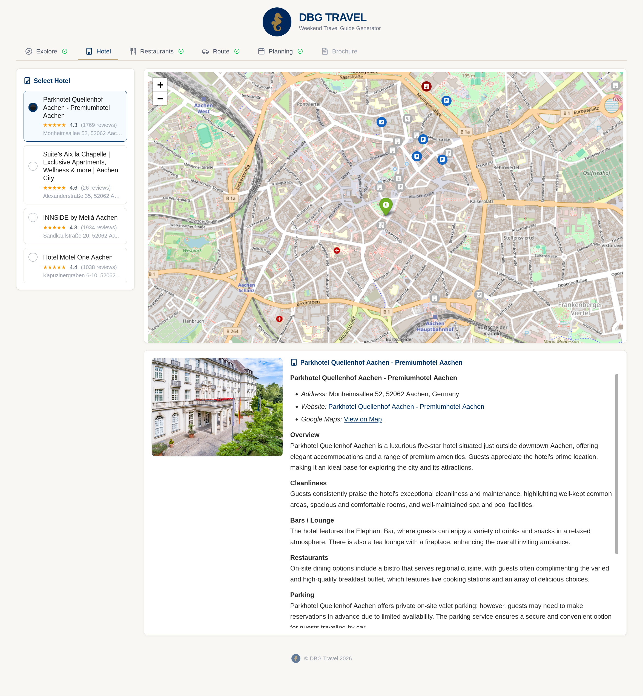
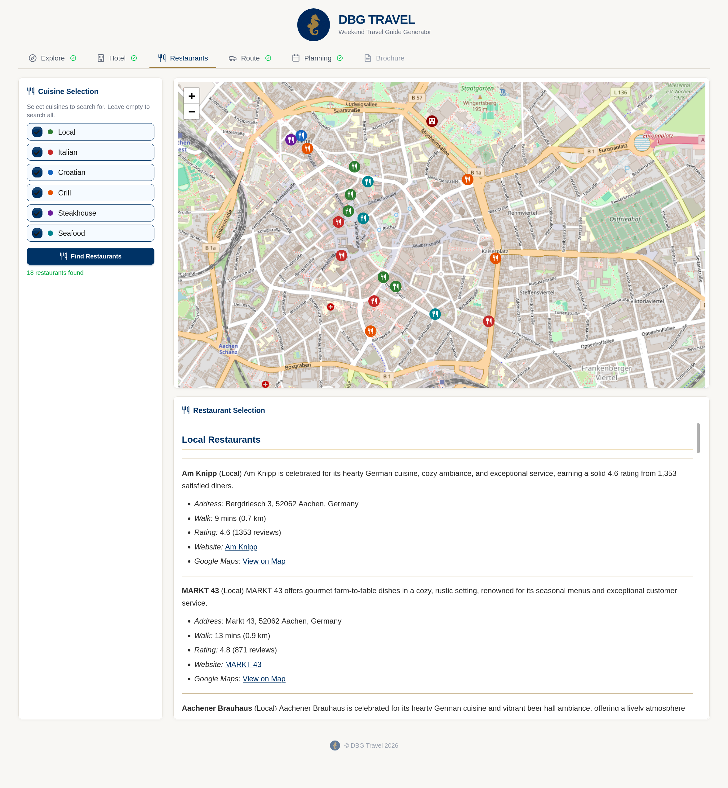
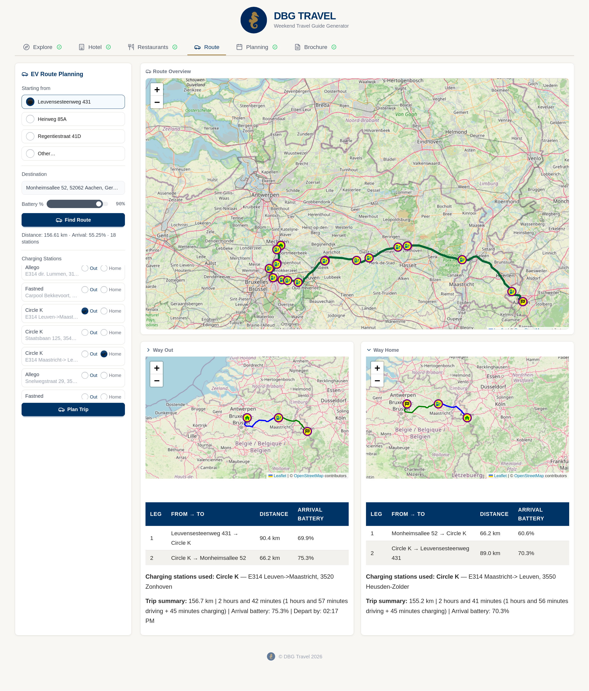
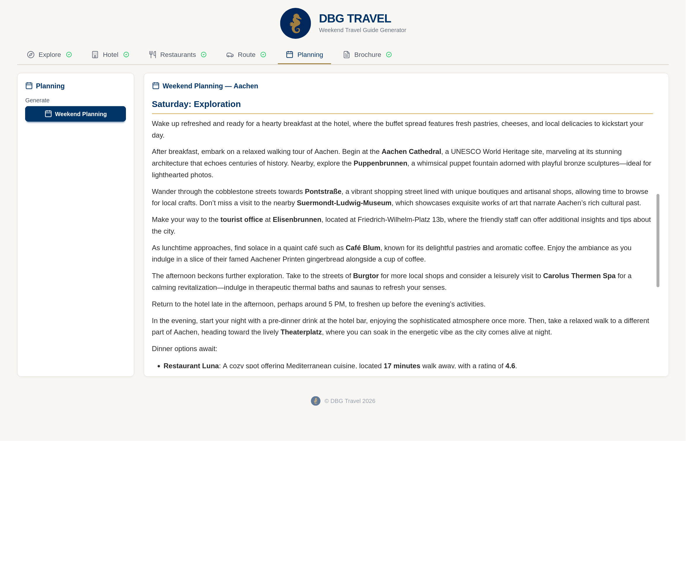
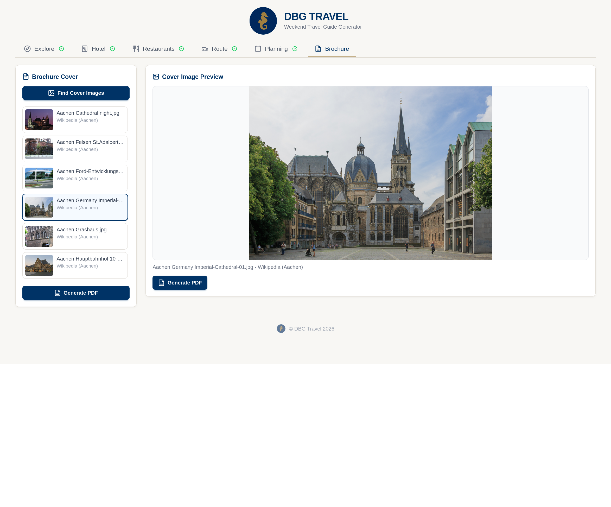

# DBG Travel - Trip Planner

DBG Travel is a weekend trip planner web application that generates branded PDF travel brochures. Enter a destination city and the app assembles a complete weekend guide with city research, hotel suggestions, restaurant picks, EV route planning, a day-by-day itinerary, and a brochure-ready cover image.

## Architecture

This project is split into a React frontend and a FastAPI backend:

- `frontend/` provides the multi-step trip planning UI. It is built with React, TypeScript, Vite, and Tailwind, and guides the user through Explore, Hotel, Restaurants, Route, Planning, and Brochure tabs.
- `backend/` exposes the API and coordinates the trip-planning pipeline. It handles city summaries, hotel search, restaurant filtering, EV charging route planning, itinerary generation, and PDF creation.
- `backend/services/` contains the domain-specific service modules for LLM prompting, geocoding, hotels, restaurants, tourist-office data, charging stations, route planning, cover images, and PDF generation.
- `backend/templates/` stores the LaTeX brochure template used to render the final PDF.
- `screenshots/` contains the UI captures used in this README.

At a high level, the app works like this:

1. The user enters a destination city in the frontend.
2. The backend enriches that destination with travel, hotel, dining, routing, and itinerary data.
3. The frontend presents the results step by step in the tabs.
4. The Brochure tab combines the gathered content into a downloadable travel brochure.

## Project Layout

```text
backend/                FastAPI backend and service layer
frontend/               React + TypeScript frontend
screenshots/            README screenshots for each UI step
README.md               Project overview and setup guide
SESSION_CONTEXT.md      Session state tracking
REQUIREMENTS.md         Feature specification and issue tracking
myTripPlanner_V08.ipynb Original Gradio notebook reference
```

## Setup

### Prerequisites

- Python 3.11+
- Node.js 18+
- LaTeX installation for PDF generation, including `texlive-xetex`, `texlive-latex-extra`, and `pandoc`

### Backend

**Linux/macOS:**

```bash
python3 -m venv .venv
source .venv/bin/activate
uv pip install -r backend/requirements.txt
```

**Windows (PowerShell):**

```powershell
python -m venv .venv
.venv\Scripts\Activate.ps1
uv pip install -r backend/requirements.txt
```

If `uv` is not available, use `pip install -r backend/requirements.txt` instead.

Create a `.env` file in the project root with the required API keys:

```env
OPENROUTER_API_KEY=...      # LLM provider
TAVILY_API_KEY=...          # Web search and cover image search
ORS_API_KEY=...             # OpenRouteService routing and directions
GOOGLE_MAPS_API_KEY=...     # Places, hotel, and restaurant data
```

Then start the backend:

```bash
uvicorn backend.main:app --reload --port 8000
```

### Frontend

```bash
cd frontend
npm install
npm run dev
```

Then open `http://localhost:5173` in your browser.

### PDF Generation

PDFs are produced server-side with LaTeX, via pandoc and xelatex. Make sure the required TeX packages are installed:

```bash
sudo apt install texlive-xetex texlive-latex-extra pandoc
```

For icon support in the PDF, install `fonts-font-awesome`. The brochure pipeline may also rely on Ghostscript (`gs`) for compression.

## Usage

1. Start both the backend and frontend.
2. Open the app in your browser.
3. Enter a destination city and country in the Explore tab.
4. Review the generated city guide and tourist-office information.
5. Move to the Hotel tab and choose a suitable place to stay.
6. Open the Restaurants tab to filter cuisines and compare dining options.
7. Use the Route tab to plan the EV journey, including charging stops.
8. Open the Planning tab to generate the weekend itinerary.
9. Visit the Brochure tab, choose a cover image, and generate the final PDF.

Typical flow:

- Explore first to confirm the destination and read the city overview.
- Pick a hotel before planning the rest of the weekend, so the itinerary can stay realistic.
- Select restaurants that fit the expected walk time and cuisine preferences.
- Generate the route last if you want the trip to include EV charging details and travel time estimates.
- Finish by creating the brochure, which packages the whole trip into a polished document.

## Screenshots

### 1. Explore

The Explore tab is the starting point. It lets you enter a city and country, then generates the destination guide and tourist-office context for the trip.



### 2. Destination Guide

After the city is loaded, the Explore view expands into a full city guide with background information, top attractions, and a tourist-office map.



### 3. Hotel Selection

The Hotel tab shows candidate hotels on the map and in a ranked list, along with detailed property information and photos.



### 4. Restaurant Selection

The Restaurants tab filters venues by cuisine, displays them on the map, and shows walking distance, rating, and detail cards for each option.



### 5. Route Planning

The Route tab builds an EV-friendly driving plan with charging stops, outbound and return leg summaries, and a route map.



### 6. Weekend Planning

The Planning tab generates the day-by-day weekend itinerary, turning the selected destination into a readable trip plan.



### 7. Brochure Creation

The Brochure tab lets you choose a cover image, preview it, and generate the final PDF brochure.



## Tech Stack

- **Backend:** FastAPI, OpenRouter, Google Maps API, OpenRouteService, Tavily Search
- **Frontend:** React 19, TypeScript 6, Vite 8, Tailwind 4, DaisyUI, react-markdown
- **PDF:** LaTeX via pandoc and xelatex
