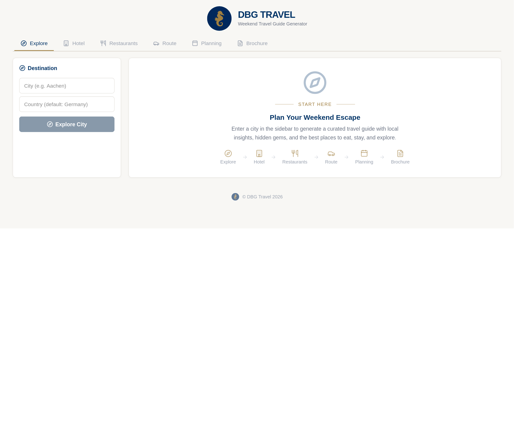
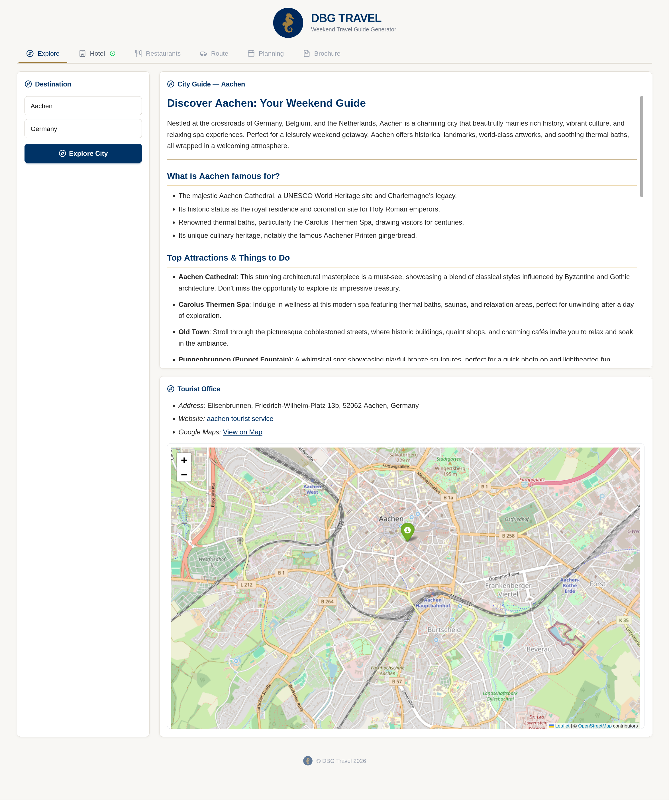
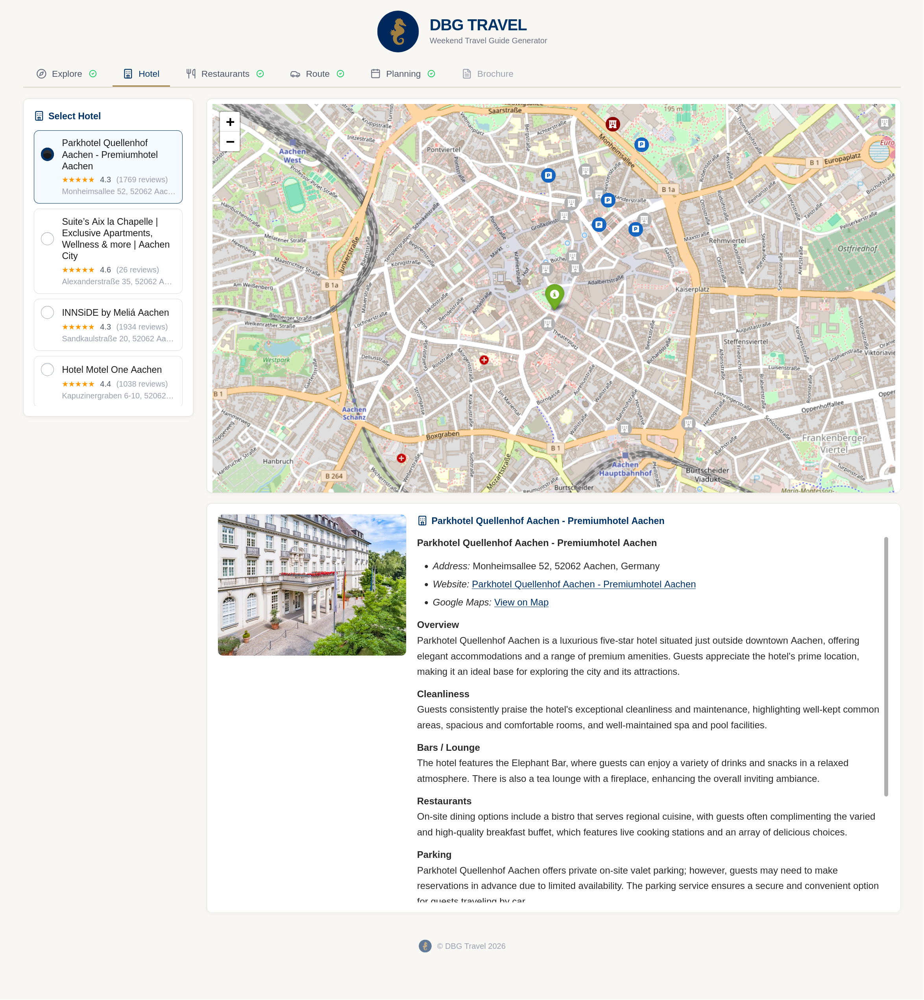
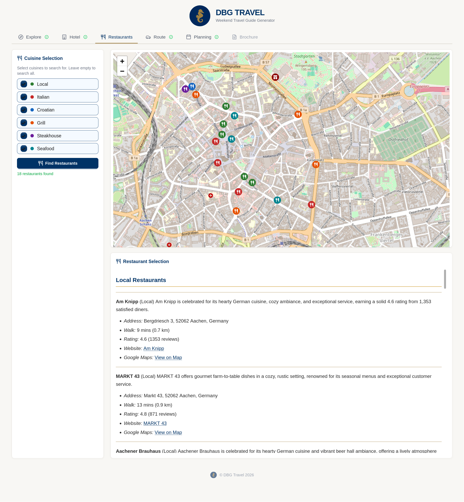
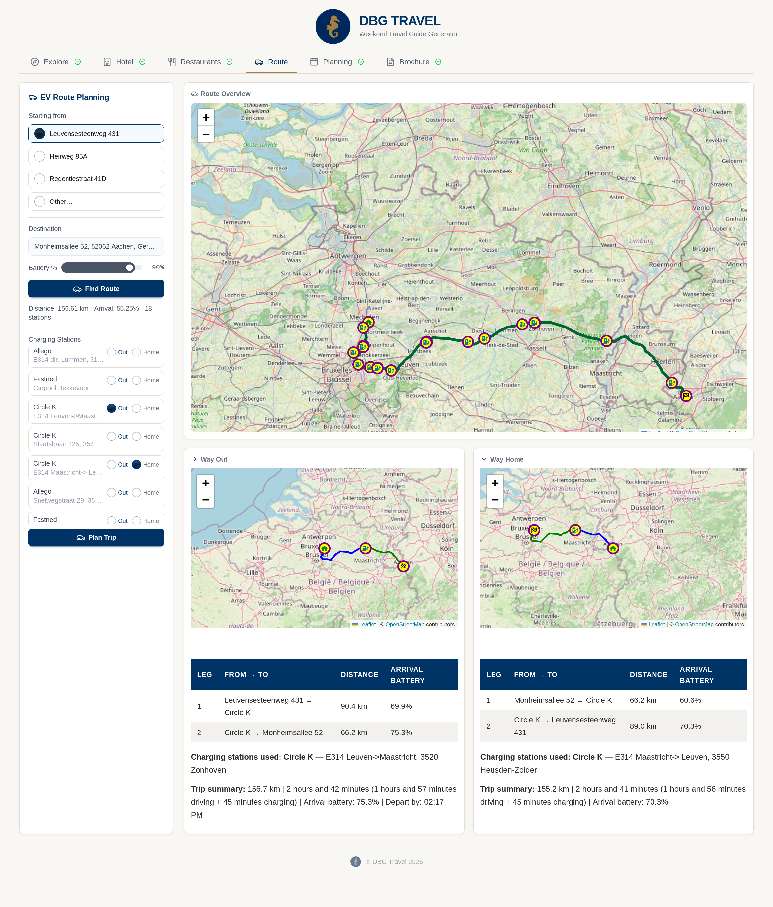
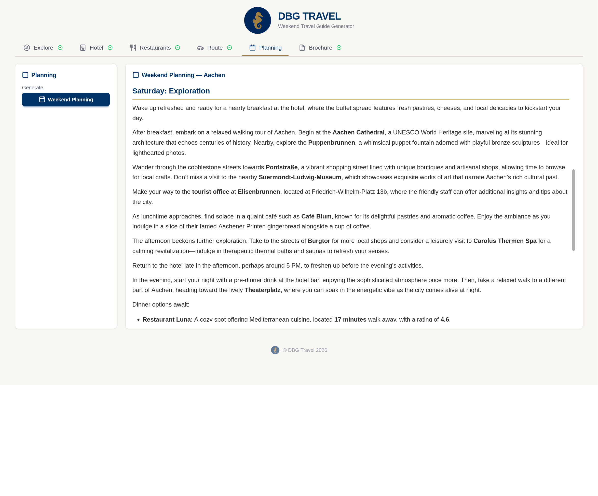
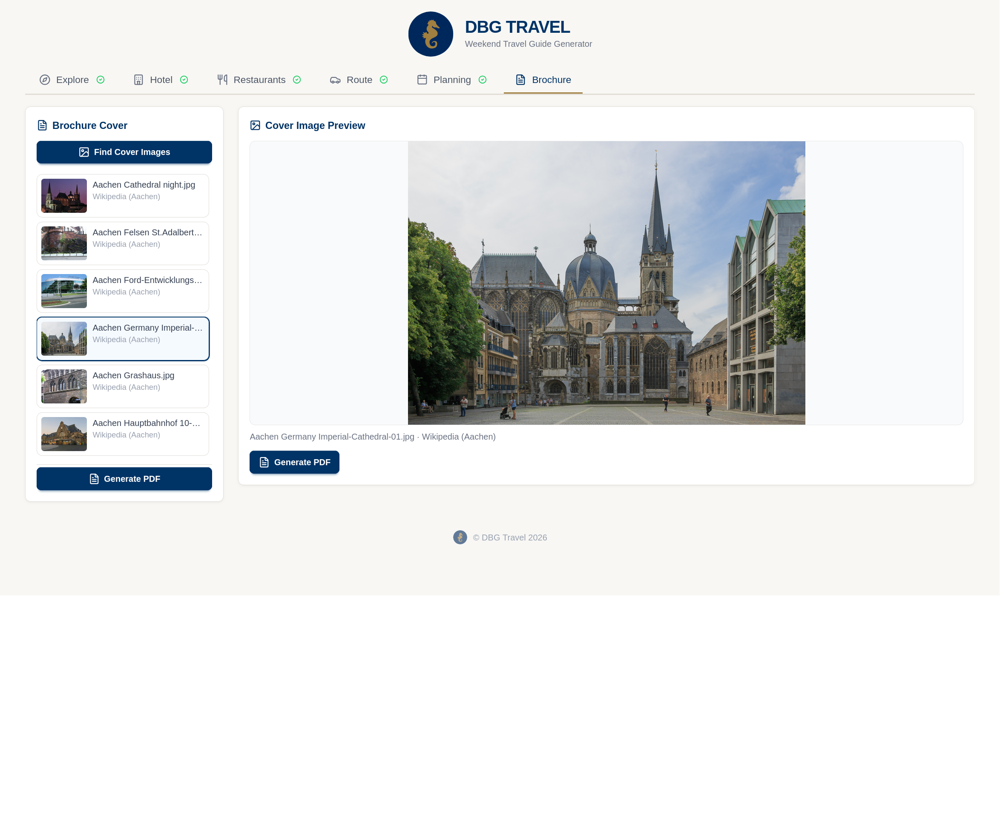

# DBG Travel — Trip Planner

A weekend trip planner web application that generates branded PDF travel brochures. Enter a destination and the app produces a complete weekend guide with city research, hotel recommendations, restaurant selection, EV route planning, day-by-day itinerary, and a printable brochure.

---

## Architecture

```
frontend/                 React 19 + TypeScript 6 + Vite 8 + Tailwind 4 + DaisyUI
backend/                  FastAPI (Python 3.11+)
├── main.py               App entry point — 18 API endpoints
├── config.py             API keys, thresholds, routes, constants
├── services/             Domain and rendering service modules
│   ├── llm.py            LLM orchestration with auto-fallback
│   ├── city_guide.py     Tavily search + LLM city guide generation
│   ├── hotels.py         Google Places hotel search + Folium maps + parking
│   ├── restaurants.py    Google Places + cuisine filter + walking cap + Folium
│   ├── tourist_office.py Tourist info lookup + Folium map
│   ├── geo.py            Geocoding, ORS routing, Google Maps URLs
│   ├── charging.py       EV charging BFS route planner + ORS distance matrix
│   ├── planner.py        Weekend itinerary via LLM
│   ├── pdf.py            Markdown assembly → Pandoc renderer → PDF
│   ├── layout_chat.py    GPT Luna constrained brochure-layout commands
│   └── cover_images.py   Wikipedia + Tavily + Bing cover image search
├── templates/
│   ├── travel_template.tex  XeLaTeX brochure template (default / rollback)
│   └── travel_template.typ  Typst brochure template (opt-in)
├── filters/
│   └── typst_layout.lua  Pandoc layout blocks → Typst page/card controls
└── static/               Static assets (logo, etc.)
```

### Data Flow

1. Enter a destination city → backend fetches city guide + tourist office info
2. Select hotel → Google Places search filtered to 4-5 star, indoor parking lookup
3. Choose cuisines → restaurants filtered by cuisine, walking cap (1.5 km), min reviews (50)
4. Plan route → BFS over ORS distance matrix finds optimal EV charging stops
5. Generate itinerary → LLM builds Friday–Sunday plan using real weekend pattern
6. Create brochure → markdown assembled → CodeMirror editor (editable) → Pandoc + selected renderer → PDF

---

## Tech Stack

| Layer       | Technology                                |
|-------------|-------------------------------------------|
| Backend     | FastAPI, OpenRouter (content model + GPT Luna layout commands), httpx |
| Maps        | Folium, OpenStreetMap, Leaflet, BeautifyIcon |
| Routing     | OpenRouteService (ORS)                    |
| Places      | Google Maps / Places API                  |
| Search      | Tavily Search API                         |
| Images      | Wikimedia Commons, Tavily, Bing           |
| Frontend    | React 19, TypeScript 6, Vite 8, Tailwind 4, DaisyUI |
| PDF         | Pandoc + XeLaTeX (default) or Typst, Ghostscript compression |
| Editor      | CodeMirror 6 (@codemirror/lang-markdown)   |
| PDF Viewer  | EmbedPDF (@embedpdf/react-pdf-viewer)     |

---

## Backend Endpoints (FastAPI)

All endpoints are at `http://localhost:8000`. API docs at `/docs`.

### City & Tourist Office

| Method | Path                    | Description                                             |
|--------|-------------------------|---------------------------------------------------------|
| POST   | `/api/city-guide`       | Generate city guide + tourist office info + map + photos |
| POST   | `/api/cover-images`     | Search cover images (Wikipedia, Tavily, tourist website) |
| POST   | `/api/cover-images/upload` | Upload a user cover image (multipart)                |
| POST   | `/api/cover-images/from-url` | Download an image from a URL as cover              |
| GET    | `/api/pdf/cover/{filename}` | Serve a user-uploaded cover image                   |

### Hotels

| Method | Path                    | Description                                             |
|--------|-------------------------|---------------------------------------------------------|
| POST   | `/api/hotels`           | Search 4-5 star hotels + generate hotel map             |
| POST   | `/api/hotels/map`       | Regenerate hotel map (with optional selection + parking) |
| POST   | `/api/hotels/describe`  | Get LLM description + parking info for a specific hotel  |

### Restaurants

| Method | Path                    | Description                                             |
|--------|-------------------------|---------------------------------------------------------|
| POST   | `/api/restaurants`      | Find restaurants near hotel (cuisine filter, walk cap, min reviews) + map |

### Route & Charging

| Method | Path                    | Description                                             |
|--------|-------------------------|---------------------------------------------------------|
| POST   | `/api/route`            | Calculate route + find charging stations + route map     |
| POST   | `/api/route/plan`       | Plan trip with user-selected charging stops              |

### Itinerary

| Method | Path                    | Description                                             |
|--------|-------------------------|---------------------------------------------------------|
| POST   | `/api/planner`          | Generate Friday–Sunday weekend itinerary                |

### Brochure / PDF

| Method | Path                              | Description                                     |
|--------|-----------------------------------|-------------------------------------------------|
| POST   | `/api/brochure/markdown`          | Assemble brochure markdown (no PDF compilation) |
| POST   | `/api/brochure/layout-chat`       | Apply a constrained GPT Luna layout adjustment  |
| POST   | `/api/pdf`                        | Generate PDF with configured XeLaTeX or Typst renderer |
| GET    | `/api/pdf/preview/{filename}`     | Serve PDF for inline preview                    |
| GET    | `/api/pdf/download-attachment/{filename}` | Download PDF as attachment           |
| POST   | `/api/pdf/finalize`               | Copy PDF from temp/ → guides/{city}.pdf + clean temp |

### Health

| Method | Path                    | Description                                             |
|--------|-------------------------|---------------------------------------------------------|
| GET    | `/api/health`           | Health check → `{"status":"ok","timestamp":"..."}`      |

---

## Frontend Tabs & Components

The UI is a 6-step wizard — each tab depends on data from the previous step.

| Tab # | Tab          | Component / Feature              | Depends On              |
|-------|--------------|----------------------------------|-------------------------|
| 0     | Explore      | City guide + tourist office map  | — (start here)          |
| 1     | Hotel        | Hotel list + Folium map + parking| City guide loaded       |
| 2     | Restaurants  | Cuisine filter + restaurant list + map | Hotel selected    |
| 3     | Route        | EV route + charging stops + map  | — (works standalone)    |
| 4     | Planning     | Weekend itinerary generation     | Hotel selected          |
| 5     | Brochure     | Cover image gallery + CodeMirror editor + PDF preview + download | All above |

**Components:**
- `MarkdownEditor.tsx` — CodeMirror 6 (light theme, markdown language)
- `PDFPreview.tsx` — EmbedPDF viewer (fit-to-width, vertical scroll)
- `HtmlPreview.tsx` — Rendered markdown preview (react-markdown)

## Setup

### Prerequisites

- Python 3.11+
- Node.js 18+
- Pandoc and a XeLaTeX distribution for the default PDF renderer
- Typst for the opt-in Typst PDF renderer
- A Chromium-compatible browser for Playwright map screenshots
- Ghostscript for PDF compression (optional)

The app can run without the optional PDF tooling, but generating a full brochure PDF requires Pandoc, a configured renderer (XeLaTeX by default or Typst), and a browser available to Playwright.

### Unix / macOS

#### 1. Install system dependencies

On Debian/Ubuntu, install the PDF dependencies with:

```bash
sudo apt update
sudo apt install texlive-xetex texlive-latex-extra pandoc fonts-font-awesome ghostscript
```

On macOS, install Pandoc, a TeX distribution that includes XeLaTeX (such as MacTeX), and optionally Ghostscript using your preferred package manager.

For the optional Typst renderer, install Typst with your preferred package manager, for example `brew install typst`.

#### 2. Create and install the backend environment

From the project root:

```bash
python3 -m venv .venv
source .venv/bin/activate
python -m pip install --upgrade pip
python -m pip install -r backend/requirements.txt
python -m playwright install chromium
```

#### 3. Configure API keys

Create `.env` in the project root:

```env
OPENROUTER_API_KEY=...       # LLM provider (OpenAI-compatible)
OPENROUTER_LAYOUT_MODEL=openai/gpt-6-luna  # Optional: constrained brochure layout chat
TAVILY_API_KEY=...           # Web search + cover image search
ORS_API_KEY=...              # OpenRouteService routing
GOOGLE_MAPS_API_KEY=...      # Google Places API
```

#### 4. Start the backend

```bash
uvicorn backend.main:app --reload --port 8000
```

#### 5. Start the frontend in a second terminal

```bash
cd frontend
npm install
npm run dev
```

Open `http://localhost:5173`. The backend is available at `http://localhost:8000`, with interactive API documentation at `http://localhost:8000/docs`.

### Windows (PowerShell)

#### 1. Install system dependencies

- Install Python 3.11+ and Node.js 18+.
- Install Pandoc.
- Install a TeX distribution with XeLaTeX, such as MiKTeX or TeX Live.
- Install Typst if you want to use the optional Typst renderer: `winget install typst`.
- Optionally install Ghostscript for PDF compression.

Ensure the installed command-line tools are on your `PATH`, then open a new PowerShell terminal.

#### 2. Create and install the backend environment

From the project root:

```powershell
py -m venv .venv
.\.venv\Scripts\Activate.ps1
py -m pip install --upgrade pip
py -m pip install -r backend\requirements.txt
py -m playwright install chromium
```

If PowerShell reports that script execution is disabled when activating the environment, apply this setting only to the current PowerShell session and retry activation:

```powershell
Set-ExecutionPolicy -Scope Process -ExecutionPolicy Bypass
.\.venv\Scripts\Activate.ps1
```

#### 3. Configure API keys

Create a `.env` file in the project root:

```env
OPENROUTER_API_KEY=...       # LLM provider (OpenAI-compatible)
OPENROUTER_LAYOUT_MODEL=openai/gpt-6-luna  # Optional: constrained brochure layout chat
TAVILY_API_KEY=...           # Web search + cover image search
ORS_API_KEY=...              # OpenRouteService routing
GOOGLE_MAPS_API_KEY=...      # Google Places API
```

#### 4. Start the backend

```powershell
.\.venv\Scripts\Activate.ps1
py -m uvicorn backend.main:app --reload --port 8000
```

#### 5. Start the frontend in a second PowerShell terminal

```powershell
cd frontend
npm install
npm run dev
```

Open `http://localhost:5173`. The backend is available at `http://localhost:8000`, with interactive API documentation at `http://localhost:8000/docs`.

---

## Key Configuration (`backend/config.py`)

| Constant                     | Default                          | Description                         |
|-----------------------------|-----------------------------------|-------------------------------------|
| `HOME_ADDRESS`              | Heirweg 85A, 9190 Stekene, Belgium | Departure address for EV routing   |
| `ALLOWED_CUISINES`          | Local, Italian, Croatian, Grill, Steakhouse, Seafood | Only these appear in brochures |
| `RESTAURANT_SEARCH_RADIUS`  | 3000                             | Google Places search radius from hotel (m) |
| `WALK_DISTANCE_MAX_METERS`  | 2500                             | Maximum straight-line hotel distance (m); taxi is acceptable |
| `REVIEW_MINIMUM`            | 50                               | Minimum Google reviews count        |
| `BATTERY_CAPACITY_KWH`      | 78.0                             | EV battery capacity                 |
| `CONSUMPTION_KWH_PER_100KM` | 17.31                            | EV consumption rate                 |
| `CHARGE_UP_TO_PERCENT`      | 90.0                             | Target charge level                 |

---

## PDF Pipeline

1. `build_markdown(data)` — assembles editable brochure Markdown and inserts `<!-- pagebreak -->` directives before brochure sections and restaurant cuisine groups. The Restaurant tab itself remains free of page-break directives.
2. `generate_pdf(md, city, ...)` — runs Pandoc with the configured renderer:
   - Inject cover image (JPEG/PNG only)
   - Screenshot restaurant map via Playwright Chromium (embedded as PNG)
   - Download and embed hotel photo
3. `compress_pdf(pdf_path)` — optional Ghostscript compression (non-blocking)

PDFs are saved to `guides/temp/` during generation. Call `POST /api/pdf/finalize` to copy to `guides/{city}.pdf` and clean the temp directory.

### Renderer configuration and rollback

The default remains the established XeLaTeX renderer:

```env
PDF_ENGINE=xelatex
```

To evaluate the Typst layout, install Typst and set:

```env
PDF_ENGINE=typst
```

Switching `PDF_ENGINE` back to `xelatex` is the immediate rollback path. The XeLaTeX template remains at `backend/templates/travel_template.tex`; the Typst template is `backend/templates/travel_template.typ`.

The Typst template builds in these layout defaults:

- hotel photos are centered;
- restaurant maps are centered;
- restaurant cards stay together when a complete card fits on a page;
- hotel photos and restaurant maps are centered;
- restaurant cards stay together when a complete card fits on a page;
- restaurant cuisine groups start with an editable page-break directive.

The Brochure editor includes a small GPT Luna layout assistant for image size/alignment, restaurant spacing, and restaurant-card pagination changes. Page breaks are deliberately manual: edit the visible `<!-- pagebreak -->` comments in the brochure Markdown, then regenerate the preview. These directives are hidden in rendered previews and are never included in the Restaurants tab. Use **Undo** to restore prior chat-applied layout settings.

### XeLaTeX Template (`travel_template.tex`)

- DBG Travel branded title page with logo and cover image
- `tocdepth=2` (no subsubsections in TOC)
- `nowidow` package prevents orphaned lines
- `\detokenize{}` around image paths to handle underscores
- Font Awesome icons for cuisine markers in the restaurant legend

---

## Screenshots

### 1. Explore

The Explore tab is the starting point. Enter a city and country, then the app generates the destination guide and tourist-office context.



### 2. Destination Guide

After the city is loaded, the view expands into a full city guide with background information, top attractions, and a tourist-office map.



### 3. Hotel Selection

The Hotel tab shows candidate hotels on the map and in a ranked list, with detailed property information and photos.



### 4. Restaurant Selection

The Restaurants tab filters venues by cuisine, displays them on the map, and shows walking distance, rating, and detail cards for each option.



### 5. Route Planning

The Route tab builds an EV-friendly driving plan with charging stops, outbound and return leg summaries, and a route map.



### 6. Weekend Planning

The Planning tab generates the day-by-day weekend itinerary.



### 7. Brochure Creation

The Brochure tab lets you choose a cover image, edit the markdown, and generate the final PDF brochure.

